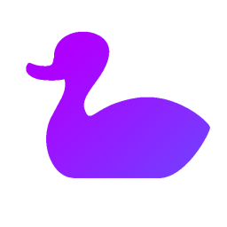

<p align="center">
  <a href="https://github.com/WhiteBlackGoose/HonkSharp">
    
  </a>
</p>


<h1 align=center>Honk#</h1>
<p align=center><i>Modern library for declarative programmign in C#. Available on <a href="https://www.nuget.org/packages/HonkSharp">NuGet</a>.</i></p>

Honk in C#!

We, C# programmers, also deserve beautiful code like in F#. We don't have duck typing, arbitrary operators, discriminated unions,
currying, **but** instead we can have fluent coding, lazy properties, and many more.

This repo contains some wrappers and API and methods for fast and convenient declarative coding in C#,
including features from functional, fluent, and lazy programming.

- [Functional programming](#functional)
- [Fluent programming](#fluency)
- Lazy programming

Go to [examples](#examples) or [features](#features).

## Functional

### Either

The purpose of this type is to mimic an anonymous DU. For example,
```cs
var a = new Either<string, int>(5);
var b = new Either<string, int>("Hello, world");
Either<string, int> f(bool test) => test ? a : b; // We can return either of them
```
are both valid, where in the first one `Either` is an `int`, and in the second one, it's a `string`. It may take up to 16 types.
It is equivalent to F#:
```fs
let a = Choice2Of2 5
let b = Choice1Of2 "Hello, world"
let f = function true -> a | false -> b // We can return either of them
```
or [F# in the future](https://github.com/dotnet/fsharp/pull/10896):
```fs
let a = 5
let b = "Hello, world"
let f : _ -> (int|string) = function true -> a | false -> b // We can return either of them
```
Assume
```cs
Either<string, int, (int quack, float duck)> a = ... // we don't care
```
which is equivalent to F#:
```fs
let a : Choice<string, int, {| quack:int; duck:float |}> a = ... // We don't care
```
```fs
let a : (string|int|{| quack:int; duck:float |}) a = ... // We don't care
```
Here is how we work with Either.

#### 1. Switch over all cases
```cs
var res = a.Switch(
    s => $"It's a string {s}!",
    i => $"It's an int {i}!",
    q => $"It's a tuple {q.quack}!"
)
```
Equivalent to F#:
```fs
let res = a |> function
    | Choice1Of3 s -> $"It's a string {s}!"
    | Choice2Of3 i -> $"It's an int {i}!"
    | Choice3Of3 q -> $"It's a tuple {q.quack}!"
```
```fs
let res = a |> function
    | :? string as s -> $"It's a string {s}!"
    | :? int as i -> $"It's an int {i}!"
    | :? {| quack:int; duck:float |} as q -> $"It's a tuple {q.quack}!"
```
Note that in F# you can also reorder the branches, which unfortunately we can't imitate.
#### 2. Check the type of the either
```cs
if (a.Is<int>(out var i))
    Console.WriteLine($"It's an int {i}!");
```

Equivalent to F#:
```fs
match a with
| Choice2Of3 i -> printfn $"It's an int {i}!" | _ -> ()
```
```fs
match a with
| :? int as i -> printfn $"It's an int {i}!" | _ -> ()
```
#### 3. Try casting
```cs
var res = a.As<int>().Switch(
    i => $"Cast successful! {i}"
    _ => "Cast failed :("
);
```

Equivalent to F#:
```fs
let res = a |> function
    | Choice2Of3 i -> $"Cast successful! {i}"
    | _ -> "Cast failed :("
```
```fs
let res = a |> function
    | :? int as i -> $"Cast successful! {i}"
    | _ -> "Cast failed :("
```
#### 4. Force casting
Since `As` returns an Either of result and failure, we can force the best case by
`AssumeBest`:
```cs
var res = a.As<int>().AssumeBest();
Console.WriteLine($"It's an int: {res}");
```
If `a` turns out to be a non-int, then `AssumeBest` will throw an exception (see fluent coding for more info).
Equivalent to F#:
```fs
let res = a |> function Choice2Of3 i -> i
printfn $"It's an int: {res}"
```
```fs
let res = a |> function :? int as i -> i
printfn $"It's an int: {res}"
```
## Fluency

#### 1. Pipe

```cs
Method(b)
```
<=>
```cs
b.Pipe(Method)
```

Equivalent to F#:
```fs
Method b
```
<=>
```fs
b |> Method
```

#### 2. Inject

```cs
a
.Inject(b)
.Pipe((a, b) => a + b)
```

Equivalent to F#:
```fs
(a, b)
||> fun a b -> a + b
// or
(a, b) ||> (+)
```

#### 3. Alias

```cs
(1 + 2 + 3)
.Alias(out var someVar)
.Pipe(a => a * 2)
.Inject(someVar)
.Pipe((a, b) => a + b)
```

Equivalent to F#:
```fs
1 + 2 + 3
|> fun someVar ->
(someVar * 2
, someVar)
||> (+)
```

#### 4. NullIf

```cs
(a + 2)
.NullIf(a => a < 0)
?.Pipe(a => Math.Sqrt(a))
```

Equivalent to F#:
```fs
a + 2.
|> fun a -> if a < 0. then None else Some a
|> Option.map sqrt
```

#### 5. Let

```cs
a
.Pipe(a => a + 2)
.Let(out var six, 1 + 2 + 3)
.Pipe(a => a + 4)
.Inject(six)
```

Equivalent to F#:
```fs
a
|> (+) 2 |> fun a -> // Can't just let between pipes without aliasing first
let six = 1 + 2 + 3
a + 4,
six
```

#### 6. LetLazy

```cs
a
.Pipe(a => a + 2)
.LetLazy(out var big, _ => Console.ReadLine().Parse<int>().AssumeBest())
.Pipe(a => a - 1)
.Inject(big)
.Pipe((a, big) => a switch
{
    > 0 => 4,
    -3 => big
    _ => big + a
})
.Execute(Console.WriteLine)
```

Equivalent to F#:
```fs
a
|> (+) 2 |> fun a ->
let big = lazy (Console.ReadLine() |> int)
(a - 1
, big)
||> function
| a when a > 0 -> fun _ -> 4
| -3 -> (|Lazy|)
| a -> (|Lazy|) >> (+) a
|> printfn "%d"
```

## Examples

Imperative C#:
```cs
using System;
var input = Console.ReadLine();
string output;
if (int.TryParse(input, out var valid))
    output = $"Valid number! {valid}";
else
    output = "Oops, invalid!";
Console.WriteLine($"Input: {input}\nOutput: {output}");
```

Declarative C#:
```cs
using System;
Console.ReadLine().Alias(out var input)
.Parse<int>()
.Match(valid => $"Valid number! {valid}",
       () => "Oops, invalid!")
.Inject(input)
.Pipe((output, input) => $"Input: {input}\nOutput: {output}")
.Execute(Console.WriteLine);
```

F# equivalent of imperative:
```fs
open System
let input = Console.ReadLine()
let mutable output = Unchecked.defaultof<_>
let mutable valid = Unchecked.defaultof<_>
if Int32.TryParse(input, &valid) then
    output <- $"Valid number! {valid}";
else
    output <- "Oops, invalid!";
printfn $"Input: {input}\nOutput: {output}"
```

F# equivalent of declarative:
```fs
open System
Console.ReadLine() |> fun input ->
(input |> Int32.TryParse
|> function true, valid -> $"Valid number! {valid}"
          | _ -> "Oops, invalid!"
, input)
||> fun output input -> $"Input: {input}\nOutput: {output}"
|> printfn "%s"
```
